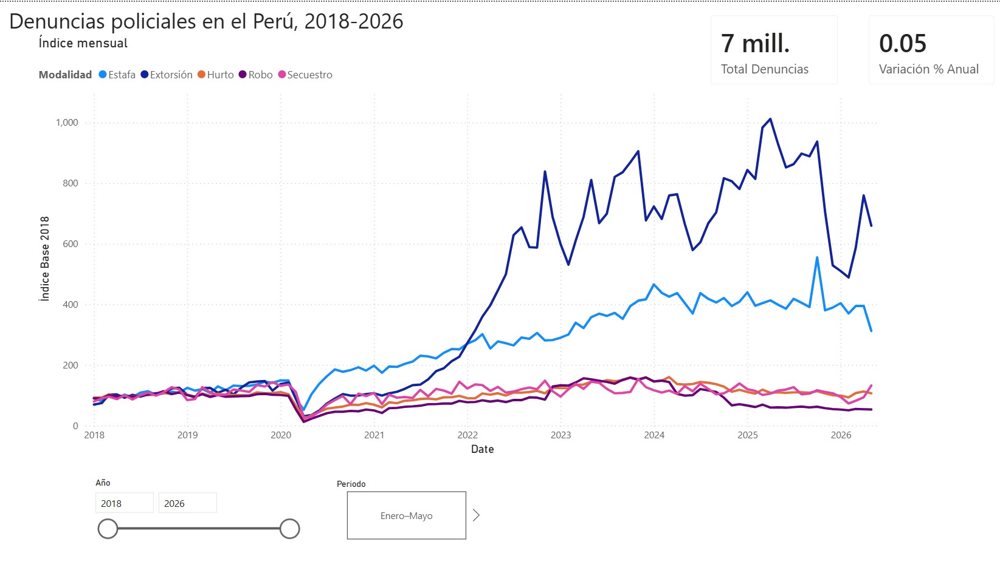
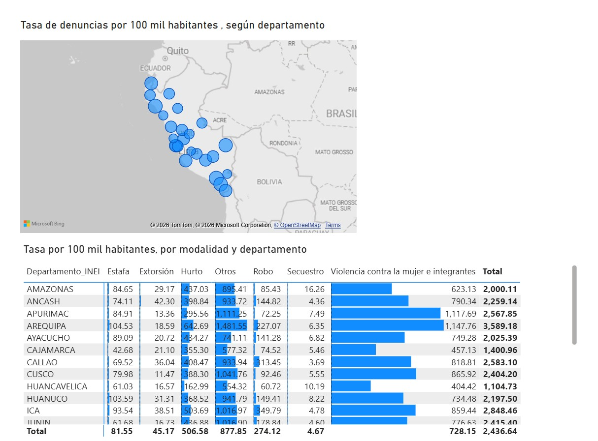
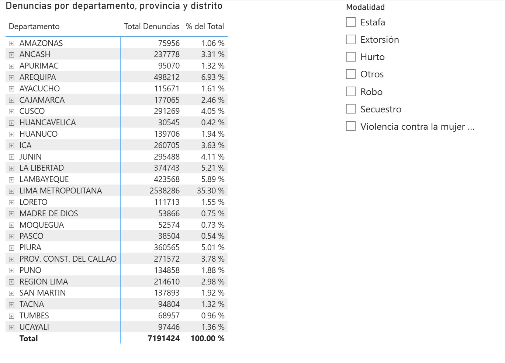
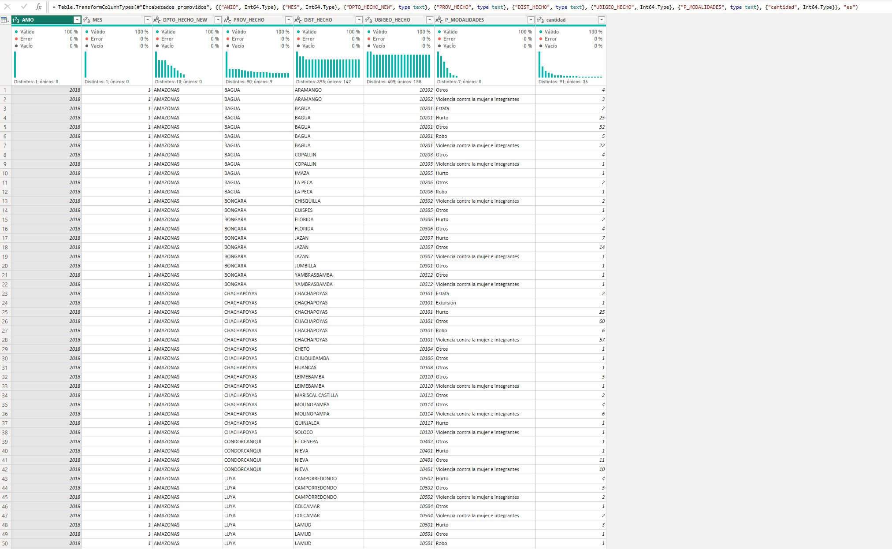
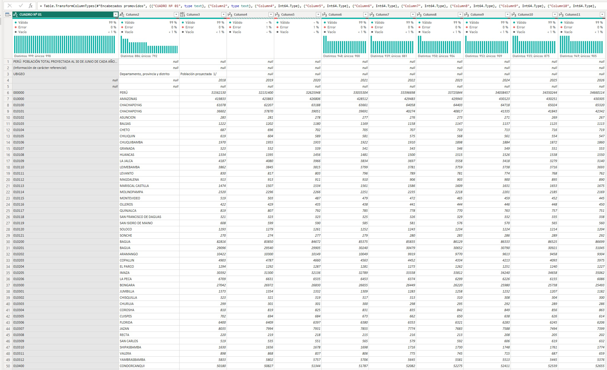
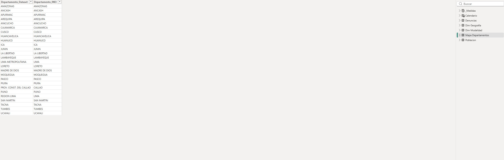
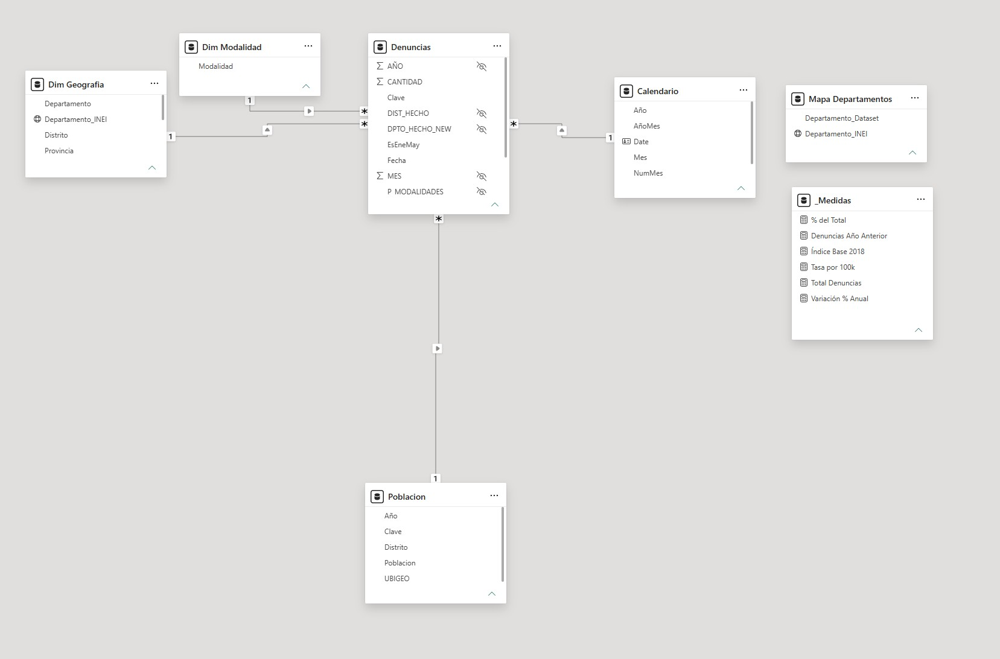

# Denuncias policiales en el Perú: análisis territorial y por modalidad, 2018–2026

Análisis de 7.19 millones de denuncias registradas en el SIDPOL de la
Policía Nacional del Perú, cruzadas con proyecciones de población del INEI
para calcular tasas por 100 mil habitantes.

**Herramientas:** Power BI Desktop, Power Query (M), DAX

## Pregunta de negocio
¿Cómo evolucionaron las denuncias policiales por modalidad en el Perú
entre 2018 y 2026, y qué departamentos presentan mayor incidencia una
vez ajustada por población?

## Informe







## Fuentes de datos

**Policía Nacional del Perú — Denuncias Policiales (SIDPOL)**  
361,792 registros de denuncias agregadas por distrito, mes y modalidad,
de enero 2018 a mayo 2026. Suma 7,191,424 denuncias en total.
Descargado el 1/08/2026.  
[Ver dataset](https://www.datosabiertos.gob.pe/dataset/denuncias-policiales)

**INEI — Población Total Proyectada por Departamento, Provincia y Distrito**  
Proyecciones de población al 30 de junio de cada año para los 1,892
distritos del país, de 2018 a 2026. Descargado el 02/08/2026.  
[Ver dataset](https://www.gob.pe/institucion/inei/informes-publicaciones/6894980-peru-poblacion-total-proyectada-al-30-de-junio-de-cada-ano-segun-departamento-provincia-y-distrito-2018-2026)

## Proceso de limpieza

El trabajo principal de este proyecto no fue la visualización, sino dejar
dos fuentes oficiales en condiciones de ser cruzadas. Encontré 4 problemas:

### Códigos UBIGEO sin ceros iniciales

El ubigeo peruano tiene seis dígitos. En el archivo original, 140,077 de
361,792 filas tenían solo cinco: los departamentos del 01 al 09 perdieron
su cero inicial porque la columna fue guardada tratándola como número.
Lo detecté activando el perfil de columna en Power Query sobre el conjunto
completo de datos, que mostró dos longitudes distintas conviviendo en la
misma columna.
Lo corregí con `Text.PadStart(Text.From([UBIGEO_HECHO]), 6, "0")`.
Sin esta corrección, el cruce posterior con población habría fallado en el
39% de los registros.



### Cuatro niveles geográficos mezclados

El archivo de población del INEI incluye en una misma columna los totales
nacionales, departamentales, provinciales y distritales, sin ninguna
columna que los distinga. Sumar la población tal cual habría contado a
cada habitante cuatro veces.
Los niveles superiores se identifican porque su ubigeo termina en `00`:
`000000` es Perú, `010000` es Amazonas, `010100` es la provincia de
Chachapoyas. Filtré con `Text.End([UBIGEO], 2) <> "00"` para conservar
solo distritos.
El archivo además traía el título del cuadro en las primeras filas, los
encabezados repartidos en dos niveles, y los nueve años como columnas
separadas, que convertí en filas mediante anulación de dinamización.



### Notas al pie incrustadas en los datos

59 registros traían la llamada a nota al pie dentro del nombre del
distrito (`AHUAYRO 15/`, `PUTIS 7/`) y sin valor numérico de población
para 2018, 2019 y 2020, por tratarse de distritos de creación reciente.
Los detecté porque la conversión de tipo de dato generó errores en esas
filas. Separé el indicador del nombre y eliminé los registros sin dato.
El efecto es que unos 18 distritos no tienen tasa calculable en esos tres
años. Representan menos del 0.4% de los registros de población.

### Lima dividida en dos departamentos

El dataset policial usa 26 departamentos en lugar de los 25 oficiales:
separa "LIMA METROPOLITANA" de "REGION LIMA", y consigna a Callao como
"PROV. CONST. DEL CALLAO". El INEI emplea la nomenclatura estándar.
Sin normalizar, el cruce habría devuelto valores nulos justo en Lima,
donde reside cerca de un tercio de la población del país.
Construí una tabla de equivalencias que unifica ambas Limas bajo "LIMA" y
normaliza Callao, manteniendo la distinción original en la tabla de
geografía para no perder capacidad de análisis.



## Modelo de datos



El modelo sigue un esquema en estrella construido a partir de una tabla
plana. La tabla de hechos `Denuncias` conserva únicamente las claves y la
métrica; las descripciones se separaron en dimensiones.

| Tabla | Rol |
|---|---|
| `Denuncias` | Hechos. Una fila por distrito, mes y modalidad |
| `Dim Geografia` | Distrito, provincia, departamento y su equivalencia INEI |
| `Dim Modalidad` | Las siete categorías de denuncia |
| `Calendario` | Tabla de fechas generada en DAX y marcada como tal |
| `Poblacion` | Población proyectada por distrito y año |
| `Mapa Departamentos` | Tabla de equivalencias de nomenclatura |

### La decisión sobre la tabla de población

Conectar `Poblacion` al modelo fue el punto menos evidente. La tabla tiene
dos claves simultáneas —ubigeo y año— y ninguna identifica una fila por sí
sola: cada distrito aparece nueve veces, una por año.
Relacionarla solo por ubigeo habría enfrentado las denuncias de un año
contra la suma de los nueve años de población. Relacionarla por
departamento habría perdido el detalle distrital y arrastrado el problema
de nomenclatura de Lima.
La solución fue crear una clave compuesta `UBIGEO-Año` en ambas tablas, de
modo que cada combinación de distrito y año se vincula con su población
correspondiente. La relación queda de uno a varios desde `Poblacion` hacia
`Denuncias`.
Un efecto secundario de esta estructura es que el filtro de departamento
llega a `Denuncias` pero no se propaga a `Poblacion`, porque el filtro fluye
de la dimensión al hecho y no al revés. Eso obligó a ajustar la medida de
tasa, como se explica en la siguiente sección.

## Medidas DAX

### Tasa por 100 mil habitantes

Convierte los conteos absolutos en incidencia comparable entre
departamentos. Es la medida que hace posible el análisis territorial: sin
ella, todos los visuales dirían lo mismo, que Lima concentra más denuncias
porque concentra más población.

```dax
Tasa por 100k = 
DIVIDE(
    [Total Denuncias],
    CALCULATE(SUM(Poblacion[Poblacion]), Denuncias)
) * 100000
```

El `CALCULATE` con `Denuncias` como argumento de filtro es lo que resuelve
el problema descrito en la sección anterior. Fuerza a que la población se
calcule solo sobre las filas visibles de la tabla de hechos, de modo que
el denominador respeta el mismo contexto que el numerador. En la primera
versión de la medida, sin ese ajuste, los 25 departamentos devolvían un
valor idéntico: la tasa nacional repetida.

### Índice base 2018

Expresa cada mes en relación al promedio mensual de 2018, tomado como 100.

```dax
Índice Base 2018 = 
VAR Base =
    CALCULATE(
        [Total Denuncias],
        ALL(Calendario),
        Calendario[Año] = 2018
    ) / 12
RETURN
    DIVIDE([Total Denuncias], Base) * 100
```

`ALL(Calendario)` desactiva el filtro de fecha para fijar la base en 2018
sin importar qué periodo esté seleccionado. La división entre 12 convierte
el total anual en promedio mensual, ya que el eje del gráfico es mensual.

Esta medida es la que permite comparar en un mismo eje modalidades de
volúmenes muy distintos. El hurto suma cientos de miles de denuncias y el
secuestro apenas miles: en valores absolutos las líneas serían ilegibles,
pero normalizadas contra su propio nivel de 2018 el contraste se vuelve
evidente.

### Variación porcentual anual

Compara cada periodo con el mismo del año anterior.

```dax
Variación % Anual = 
DIVIDE(
    [Total Denuncias] - [Denuncias Año Anterior],
    [Denuncias Año Anterior]
)
```

Se apoya en una medida auxiliar que usa `SAMEPERIODLASTYEAR`, y emplea
`DIVIDE` en lugar del operador de división para devolver un valor vacío en
vez de un error cuando el denominador es cero.

## Conclusiones
Entre 2018 y 2026, la extorsión y la estafa muestran un crecimiento que
ninguna otra modalidad replica. Tomando 2018 como base 100, la extorsión
alcanza picos superiores a 1,000 y la estafa se estabiliza alrededor de
400, mientras hurto, robo y secuestro se mantienen cerca de su nivel
inicial durante los ocho años. Los ritmos son distintos. La estafa crece de forma sostenida a partir de
la recuperación posterior a la cuarentena, desde mediados de 2020. La
extorsión, en cambio, salta bruscamente durante 2022. Un crecimiento
gradual y un salto en pocos meses sugieren fenómenos de naturaleza
distinta. Ajustar por población cambia la lectura territorial. Lima Metropolitana
concentra el 35.3% de las denuncias del país, pero al calcular la tasa por
100 mil habitantes aparecen departamentos con incidencia considerablemente
mayor. En extorsión, La Libertad registra 123 denuncias por 100 mil frente
a un promedio nacional de 45.
Estos datos miden denuncias, no delitos. Una tasa alta puede indicar mayor
presencia real del delito o una mayor propensión de la población a
denunciarlo. Los datos disponibles no permiten distinguir entre ambas
explicaciones, y determinarlo requeriría fuentes que este análisis no
contempla, como encuestas de victimización.

## Limitaciones

**Denuncias, no delitos.** El dataset registra denuncias presentadas ante
la policía, no hechos delictivos ocurridos. La diferencia entre ambos
depende de la propensión a denunciar, que varía por territorio, modalidad
y periodo.

**Categoría "Otros".** Concentra 104,838 registros, el 29% del total, sin
desagregación posible. Ese volumen queda fuera de cualquier análisis por
modalidad.

**2026 incompleto.** El archivo cubre solo de enero a mayo de 2026, por lo
que sus totales no son comparables con años completos. El informe incluye
una segmentación que permite acotar todos los años al mismo periodo
enero–mayo.
